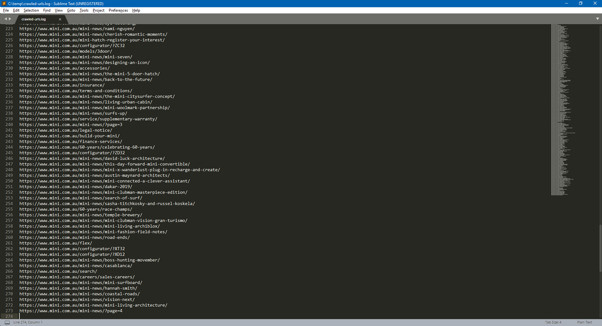
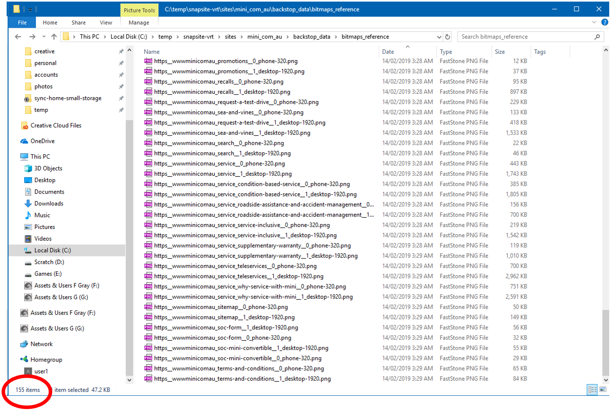
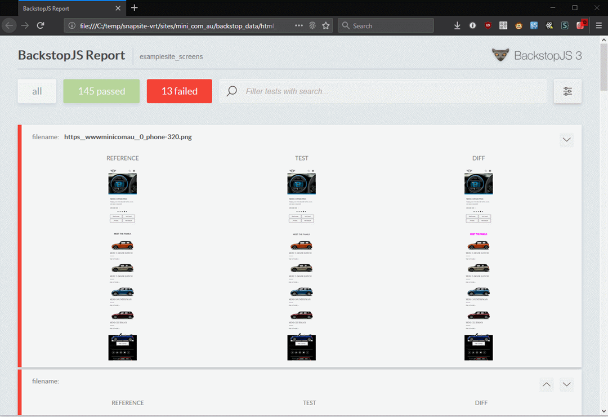
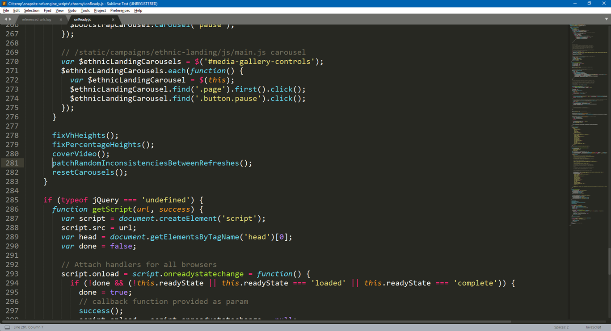
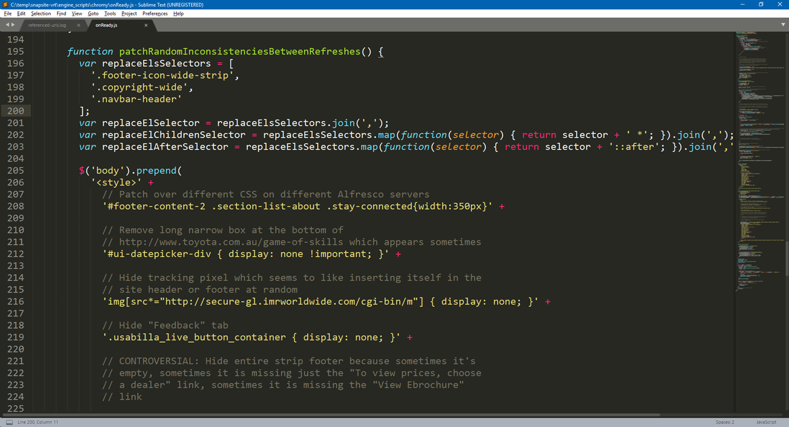
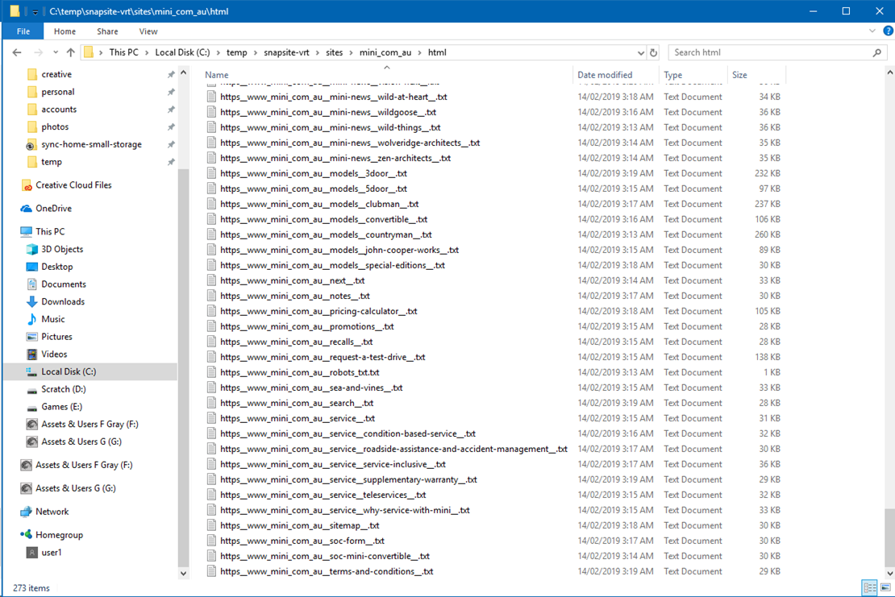
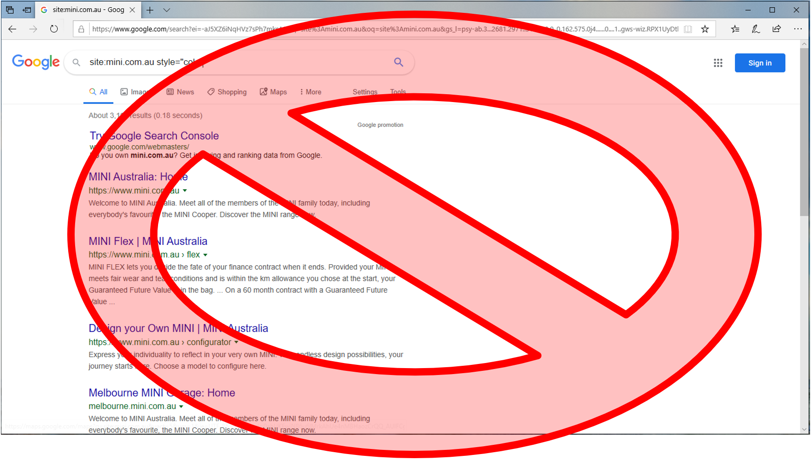
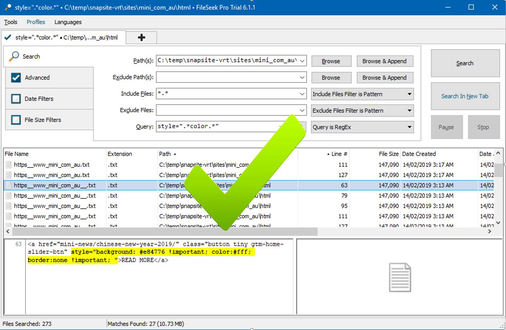

# Snapsite VRT walkthrough


**Snapshot** your website, so you can **V**isual **R**egression **T**est the whole thing in one shot.

## Installation


## How it works

**Snapsite is built with Supercrawler and BackstopJS.**
- **Supercrawler** finds all the pages, and 
- **BackstopJS** will snapshot pictures of them and diff them all for you.

(Snapsite also keeps a record of all the HTML crawled too, which can be handy for various audits.)

**We will be using a few basic commands to control these two tools:**

```
--crawl takes HTML snapshots
--reference takes pictures
--test takes pictures again & compares them
--report shows you the comparison
--approve replaces reference pics with the last test pics
```

**Commands interact through logs.**  
Some commands create logs, some read logs, some do both:

```
--crawl leaves a log of URLs
--reference reads that log (and also leaves a log)
--test reads that log (and also leaves a log, just because)
```

## OK, let's give it a `go`

We wanted a nice shiny one-liner to make marketing this tool easier, so we 
created a command called `--go` which does exactly what it says on the 
Snapsite tin — snapshot your site in one go! 

> ```
> node snapsite.js --go https://mini.com.au
> ```

## But `go` can be slow 

Note that `--go` can be broken down into separate `--crawl` and `--reference`
stages. This is a valuable thing, and we'll show you why by running each one
separately:

```
node snapsite.js --crawl https://mini.com.au
```



If you've run that exact crawl and opened `crawled-urls.log`, you'll see that
70% of the pages are news.

```
node snapsite.js --reference https://mini.com.au
```

This particular `--crawl` took 24 minutes to `--reference` on our test 
machine, and most of the news pages ... kinda look the same. That's not great
bang for buck, and this becomes more important the larger your site is.

## Speed it up with pruning

Let's prune this down...


...and run another reference.
```
node snapsite.js --reference https://mini.com.au
```

This time `--reference` took just 7 minutes!

- With pruning `crawled-urls.log`: 7 min for 80 pages x 2 sizes
- Without pruning `crawled-urls.log`: ~24 min for 270 pages x 2 sizes

## Revisiting skipped pages

Here's our scan of 80 pages x 2 sizes...



So, as expected, 80 x 2 = ... uh ... 155.  
Yep, it randomly skips pages sometimes.

Let's re-run the missing ones:
```
node snapsite.js --reference
     -o mini.com.au
     -u https://www.mini.com.au/60-years/dakar-rally/ 
        https://www.mini.com.au/configurator/
        https://www.mini.com.au/configurator/?XM72
        https://www.mini.com.au/models/john-cooper-works/
```


158 images.
So, one page to go...
```
node snapsite.js --reference
     -o mini.com.au
     -u https://www.mini.com.au/models/john-cooper-works/
```


A problematic page, no idea why (maybe `onReady.js` is bugging out?). 
Anyway, 79/80 pages is still useful.

## When that one page just won't snapshot...
The show must go on!

Let’s remove the problematic page from:
- `crawled-urls.log`
- `referenced-urls.log`


## Time to run a test!

```
node snapsite.js --test https://mini.com.au
```


Wait — but what are we testing?

We're testing stability, a change made since the last `--reference`, etc...

Let's get a look at the results!

```
node snapsite.js --report https://mini.com.au
```




Aha! We've just found page instability. (It's surprising how many pages will
change a little bit each time you load them!)

### Fixing page instability

We could potentially address it by fixing 
the variation at the source.

In our case, though, we just need to smash out test results irrespective of 
any random variation.

So, let's remove the variation by replacing elements in `onReady.js`:






Snapsite also supports BackstopJS’s `--approve`.

Mark “failures” as OK for things you *meant* to change. Useful after fixing 
a bug, which you'd marked the relevant screenshots as "no that's fine" 
earlier, when in fact it was not fine.

## ⛔ Challenges ⛔


## ✨ Charms ✨
**`--crawl` keeps a copy of all pages, which you can full-text search against
using e.g. FileSeek:**



**Audit real-world component usage and dodgy inline styles used in production
with Regex:**





